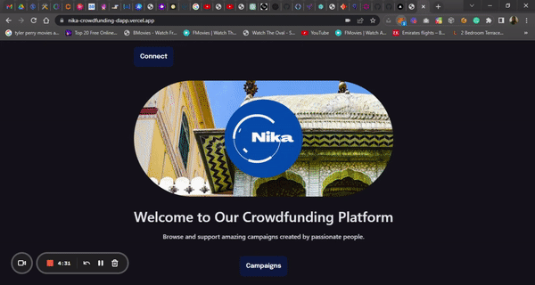

# Project Title
Nika Crowdfunding dApp
# Project Description
Nika CrowdFunding dapp for web3 developers and startups. Its smart contract allows users to create and donate to campaigns.

# Project Snapshot



# Project Website Link
This is a decentralized crowdfunding platform built on Ethereum blockchain. The platform allows users to create and support crowdfunding campaigns.

Github Link: https://github.com/anajembaedwin/nika-crowdfunding-dapp

Production Link: https://nika-crowdfunding-dapp.vercel.app/

# Project Author

Edwin - Initial work

Github Link: https://github.com/anajembaedwin

# How to Install and Run the Project
**Clone the repository**

```javascript
git clone https://github.com/anajembaedwin/nika-crowdfunding-dapp.git
```

**cd into the Client Folder**

```bash
cd nika-crowdfunding-dapp && cd client
```

**Install the dependencies**

```javascript
npm install
```

**Start the development server**

```javascript
npm run dev
```
**Port to Run the Website**

```
http://localhost:3000
```
or any other port available to view it in the browser.

- No required input/output files.

- Ensure you are using the `Goerli Test Network` on your `metamask wallet` or any other wallet when connecting.


# Explaining the Nika-Crowdfunding-SmartContract

## The Contract
The smart contract was deployed at:

https://thirdweb.com/goerli/0xE6ac95DE3f96C6FCAFd1Ae8462A56ffB1A4B8A44/sources

With this address:

```
0xE6ac95DE3f96C6FCAFd1Ae8462A56ffB1A4B8A44
```
On the `GOERLI TESTNET`.

## Web3 Package.json Scripts

- `build`: This script runs the `detect` command from the Thirdweb CLI to build the project.
- `deploy`: This script runs the `deploy` command from the Thirdweb CLI to deploy the built contracts to the specified network.
- `release`: This script runs the `release` command from the Thirdweb CLI to release the built contracts to the specified package registry.

##  Structs

`Campaign`: This struct stores information about a campaign, including its owner, title, description, target amount, deadline, amount collected, image, an array of donators, and an array of donation amounts.

##  Mapping

`campaigns`: This mapping stores all the campaigns using their campaign ID as the key.

##  Variables

`numberOfCampaigns`: This variable stores the number of campaigns that have been created.

##  Functions

`createCampaign`: This function allows a user to create a new campaign with the given information: owner, title, description, target amount, deadline, and image. It returns the ID of the created campaign.

`donateToCampaign`: This function allows a user to donate the value of msg.value to the specified campaign. It also updates the array of donators and the array of donation amounts for the campaign. If the donation is successful, it also increases the amountCollected for the campaign by the donated amount.

`getDonators`: This function returns the arrays of donators and donation amounts for the specified campaign.

`getCampaigns`: This function returns an array of all the campaigns.

##  Modifiers

`payable`: This modifier indicates that the function can receive ether.

##  Events

None.

## Dependencies

- `hardhat`: This is a development environment for Ethereum smart contracts.
- `@thirdweb-dev/contracts`: This is a package containing the contracts for the project.
- `dotenv`: This is a zero-dependency package for loading environment variables from a .env file.

## Dev Dependencies

None.


# Explaining the Nika-Crowdfunding-Client

This package.json file is used to manage the dependencies and scripts for a client project built with Thirdweb, React, and Vite.

## Client Package.json Scripts

- `dev`: This script runs the Vite development server.
- `build`: This script builds the project for production with Vite.
- `preview`: This script previews the built project.
- `deploy`: This script builds the project and uploads the built files to Thirdweb.

## Dependencies

- `@thirdweb-dev/react`: This is a package containing the React components for the project.
- `@thirdweb-dev/sdk`: This is a package containing the SDK for interacting with the Thirdweb platform.
- `ethers`: This is a library for interacting with Ethereum.
- `react`: This is a JavaScript library for building user interfaces.
- `react-dom`: This is a package that provides DOM-specific methods for React.
- `react-router-dom`: This is a package that provides routing functionality for React applications.

## Dev Dependencies

- `@vitejs/plugin-react`: This is a Vite plugin for React.
- `autoprefixer`: This is a tool that adds vendor prefixes to CSS.
- `postcss`: This is a tool for transforming styles with JavaScript.
- `tailwindcss`: This is a CSS framework.
- `vite`: This is a web development build tool.


# How Nika-Crowdfunding-Project was setup with Thirdweb, Hardhat, and Vite

## Technologies
- Thirdweb (Web3 Framework)
- Hardhat (Smart Contract development environment)
- Vite (React Framework)

## Contract setup
1. Run `npx thirdweb@latest create --contract` to create a new contract project.
2. Install `dotenv` with `npm install dotenv`.
3. Get the private key from your MetaMask account.
4. Find the endpoint for the network you want to use (e.g. Goerli). You can find the endpoint at https://www.ankr.com/rpc/eth/eth_goerli/.
5. Add the following code to your `hardhat.config.js` file:

```hardhat
defaultNetwork: 'goerli',
networks: {
hardhat: {},
goerli: {
url: 'https://rpc.ankr.com/eth_goerli',
accounts: [0x${process.env.PRIVATE_KEY}]
}
},
```

6. Run `npm run deploy` to deploy the contracts to the network.

## Client setup
1. Run `npx thirdweb@latest create --app` to create a new client project.
2. Choose the app name with `./`.
3. Select EVM (or Solana as needed).
4. Select Vite to replace using `create-react-app` for React.
5. Select JavaScript (or TypeScript as needed).
6. Install `react-router-dom` with `npm install react-router-dom`.
7. Run `npm run dev` to check your build so far.
8. Delete the `src` folder.
9. Create a new `src` folder and an `index.js` file.
10. Create a new `App.js` file with a React function component using the `rafce` snippet (ES7).
11. Convert `index.js` to `main.jsx` and `App.js` to `App.jsx`.
12. Install Tailwind CSS with Vite by running `npm install -D tailwindcss postcss autoprefixer`.
13. Run `npx tailwindcss init -p` to create the configuration files for Tailwind CSS.
14. Add the following code to your `tailwind.config.cjs` file:

```tailwind
/** @type {import('tailwindcss').Config} /
module.exports = {
content: [
"./index.html",
"./src/**/.{js,ts,jsx,tsx}",
],
theme: {
extend: {},
},
plugins: [],
}
```

# License
This project is licensed under Grandida License - see the LICENSE.md file for details.


### Attribution

Some parts of the code were adapted from Thirweb

> **DO NOT USE WITHOUT THE PERMISSION OF GRANDIDA**
